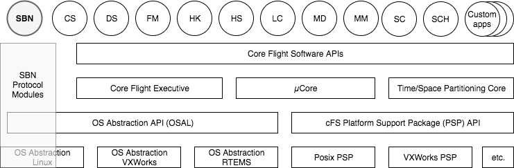
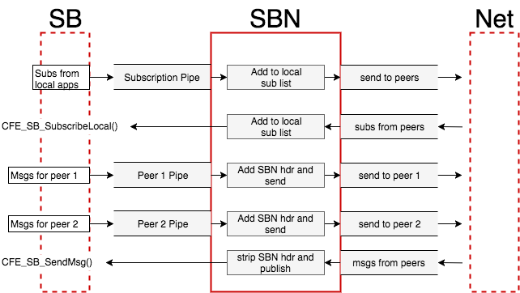
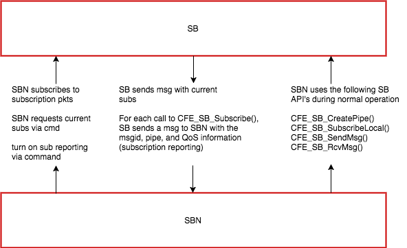
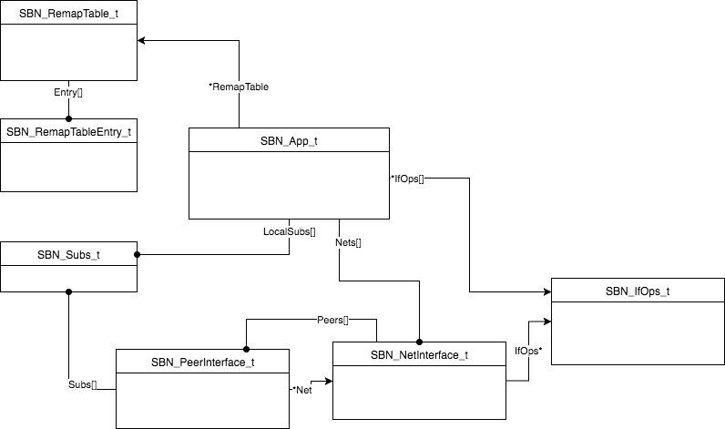

Core Flight Software (cFS) Software Bus Networking (SBN)
========================================================

Documentation Version History
------------------------------
This document details the design and use of the SBN application. This is current
as of SBN version 1.10.

This document is maintained by [Chris Knight, NASA Ames Research Center]
(Christopher.D.Knight@nasa.gov).

SBN Version History
-------------------
- SBN 1.0 – UDP-only monolithic application.
- SBN 1.1 – Added a modular network layer for Spacewire, Serial.
- SBN 1.2 \@ce1b3ca – TCP module. Merged protocol and data traffic into
  the same connections/sockets. Heartbeats only sent if no other traffic
  sent in the last number of seconds. Bug-fix to ensure SBN ignores messages it
  publishes on the SB, ensures all network messages are big-endian and aligned,
  removes windowing/retransmit logic.
- SBN 1.3 \@15f3754 – Removed sync word. Simplified module API, added MID
  remapping/filtering. Added the (compile-time) option of per-peer tasks for
  watching pipes and net.
- SBN 1.4 \@2b6556a – DTN module. Pushed protocol handling (announce/heartbeat)
  down into the modules that need it (UDP.)
- SBN 1.5 \@b5cb3d7 – When sending all subs, send them in one message.
- SBN 1.6 \@b0d0027 – Added “unload” method to modules.
- SBN 1.7 \@eff7047 – Polling occurs each cycle (modules are responsible for managing timeouts), re-added serial backend, SbnPeerData.dat uses a numeric network ID, not name.
- SBN 1.8 \@ae9a1f5 - Removed separate housekeeping status structs (moved housekeeping-related values to the main structs (`SBN_App_t`, `SBN_NetInterface_s` (`SBN_NetInterface_t`), `SBN_PeerInterface_t`). standardized on housekeeping being hand-packed big-endian.
- SBN 1.9 \@063ebf2 - Adds protocol packet to identify protocol version. For now SBN reports if the version matches or not. (Is backward-compatible.) Also modules communicate to the main SBN app when a connection is established and lost and message pipes are only created/maintained for connected peers.
- SBN 1.10 - Table-driven configuration, rather than flat-file. Removed net and peer names, instead should always use ProcessorID and NetIdx.

Overview
--------
SBN is a cFS application that connects the local software bus to one or more
other cFS nodes (who are also running SBN) such that all messages sent by an
application on one bus will be received by an application on another bus. SBN
has a modular *network* architecture (TCP, UDP, Serial, SpaceWire, etc.) to
connect *peers* and supports multiple peer networks with a local *host*
connection affiliated with each. SBN also remaps and filters messages (cFS
table-configured.)

SBN Build and Configuration
---------------------------
SBN is built like any other cFS application, either via specifying it in 
the the `TGT#_APPLISTS` parameter in the targets.cmake (for the CMake build)
or `THE_APPS` in the Makefile (for the "classic" build). Protocol modules
(`sbn_udp`, `sbn_tcp`, `sbn_dtn`, ...) should also be specified as an
application in the build process (and the module should be linked or copied
to the apps source directory). SBN must be defined as an application
in the `cfe_es_startup.scr` script but Modules should *not* be defined there.

SBN uses two tables, the "conf" table for configuring which modules to load
and which networks and peers to communicate with and the "remap" table for
identifying which Message ID's should be remapped or filtered before sending
to specific peers.

### SBN Platform Configuration

The `sbn_platform_cfg.h` file contains a number of definitions that control
how SBN allocates and limits resources as well as controlling the behavior
of SBN. Most "max" definitions relate to in-memory static arrays, so increasing
the value increases the memory footprint of SBN (in some cases, non-linearly.)

### SBN Configuration Table

The SBN configuration table is a standard cFS table defining modules and
networks of peers.

See `sbn_tbl.h` and `sbn_conf_tbl.c`.

### SBN Remapping Table

The SBN remapping table is a standard cFS table defining, on a peer-by-peer
basis, which message ID's should be remapped to other ID's, or which
message ID's should be filtered (where the "To" field is 0).

See `sbn_tbl.h` and `sbn_remap_tbl.c`.

SBN Remapping and Filtering
---------------------------
In complex SBN peer networks, it may be useful to have each node have its own
configuration of message ID's that local apps publish and subscribe to, and
to limit traffic between the nodes or map from one ID space to another. SBN
supports this via the remapping and filtering capability, which can be
configured both by the remap table at initialization time and via commands
at runtime.

The SBN remapping subsystem, by default, does not affect traffic and all
messages published on one node is sent to any peers that have subscribed
to that ID. Alternatively, SBN remapping can be configured so that ONLY
those entries that are remapped are sent to peers; and, yes, you can remap
from an MID to the same MID.

SBN remapping may be enabled at start time via a compile-time macro, and
can be enabled and disabled at runtime via the remapping configuration
command.

SBN Control Commands
--------------------
SBN has a number of commands for managing the SBN application's configuration
and for requesting housekeeping telemetry.

Macro               |CC    |Command Description                      |Parameters
--------------------|------|-----------------------------------------|------
`SBN_NOOP_CC`       |`0x00`|Do nothing beyond reporting an event.      |<none>
`SBN_RESET_CC`      |`0x01`|Resets the SBN network.                    |<none>
`SBN_RESET_PEER_CC` |`0x02`|Resets a connection to a particular peer.  |`uint8 NetIdx, uint8 PeerIdx`
`SBN_REMAPCFG_CC`   |`0x05`|Sets the remapping configuration.          |`uint8 Enabled, uint8 RemapDefaultFlag`
`SBN_REMAPADD_CC`   |`0x06`|Adds a remapping.                          |`uint32 ProcessorID, CFE_SB_MsgId_t FromMID, CFE_SB_MsgId_t ToMID`
`SBN_REMAPDEL_CC`   |`0x07`|Removes a remapping.                       |`uint32 ProcessorID, CFE_SB_MsgId_t FromMID`
`SBN_HK_CC`         |`0x0A`|Requests main housekeeping telemetry.      |<none>
`SBN_HK_NET_CC`     |`0x0B`|Requests housekeeping telemetry for a net. |`uint8 NetIdx`
`SBN_HK_PEER_CC`    |`0x0C`|Requests housekeeping telemetry for a peer.|`uint8 NetIdx, uint8 PeerIdx`
`SBN_HK_PEERSUBS_CC`|`0x0D`|Requests hk telemetry for a peer's subs.   |`uint8 NetIdx, uint8 PeerIdx`
`SBN_HK_MYSUBS_CC`  |`0x0E`|Requests hk telemetry for my subs.         |<none>

SBN Housekeeping Telemetry
--------------------------
Housekeeping command codes are used to request housekeeping telemetry messages. As all housekeeping is requested with command codes to the main (and only)
command MID, the command code used to request the housekeeping is returned
in the housekeeping payload so that they can be differentiated. All numeric
values are transmitted in big-endian order and no padding is used.

The following commands generate payloads in the following format:

*SBN_HK_CC*

Field      |Type    |Description
-----------|--------|-----------
`CC`       |`uint8` |Command code of HK request.
`CmdCnt`   |`uint16`|Number of commands received.
`CmdErrCnt`|`uint16`|Number of commands that generated errors.
`SubCnt`   |`uint16`|Number of local subscriptions.
`NetCnt`   |`uint16`|Number of networks configured.

*SBN_HK_NET_CC*

Field       |Type                        |Description
------------|----------------------------|-----------
`CC`        |`uint8`                     |Command code of HK request.
`ProtocolID`|`uint8`                     |The ID of the protocol of this network.
`PeerCnt`   |`uint16`                    |The number of peers associated with this network.

*SBN_HK_PEER_CC*

Field        |Type                         |Description
-------------|-----------------------------|-----------
`CC`         |`uint8`                      |Command code of HK request.
`QoS`        |`CFE_SB_Qos_t`               |QoS flags for this peer.
`SubCnt`     |`uint16`                     |Number of errors generated in trying to receive from this peer.
`ProcessorID`|`uint32`                     |The ProcessorID of the peer.
`LastSend`   |`OS_time_t`                  |The last time I sent a message to this peer.
`LastRecv`   |`OS_time_t`                  |The last time I received a message from this peer.
`SendCnt`    |`uint16`                     |Number of messages sent to this peer.
`RecvCnt`    |`uint16`                     |Number of messages received from this peer.
`SendErrCnt` |`uint16`                     |Number of errors generated in trying to send to this peer.
`RecvErrCnt` |`uint16`                     |Number of errors generated in trying to receive from this peer.

*SBN_HK_PEERSUBS_CC*

Field      |Type                    |Description
-----------|------------------------|-----------
`CC`       |`uint8`                 |Command code of HK request.
`PeerIdx`  |`uint16`                |Index of the peer in the request.
`SubCnt`   |`uint16`                |Number of local subscriptions.
`Subs`     |`CFE_SB_MsgId_t[SubCnt]`|Subscriptions.

*SBN_HK_MYSUBS_CC*

Field      |Type                    |Description
-----------|------------------------|-----------
`CC`       |`uint8`                 |Command code of HK request.
`SubCnt`   |`uint16`                |Number of local subscriptions.
`Subs`     |`CFE_SB_MsgId_t[SubCnt]`|Subscriptions.

SBN Interactions With the Software Bus (SB)
-------------------------------------------
SBN treats all nodes as peers and (by default) all subscriptions of local
applications should receive messages sent by publishers on other peers, and
all messages published on the local bus should be transmitted to any peers
who have applications subscribed to that message ID.

The Software Bus (SB), when an application subscribes to a message ID or
unsubscribes from a message ID, sends a message that SBN receives. Upon
receipt of these messages, SBN updates its internal state tables and sends
a message to the peers with the information on the update.

SBN Application-Level Network Protocol
--------------------------------------
In communicating with peers over a network protocol provided by a protocol
module, SBN uses an SBN message format which is comprised of the following
fields in big-endian, packed (no alignment) format:

Field    |Type    |Description
---------|--------|-----------
`MsgSz`  |`uint16`|The total size of the message, including this header.
`MsgType`|`uint8` |The type of the message (see below).
`CpuID`  |`uint32`|The ProcessorID of the sender.

Message types are an enumeration from below, although protocol modules may
send additional message types. Type values of 128 or higher (high bit set)
are reserved for module use.

MsgType        |Value |Description
---------------|------|-----------
`SBN_NO_MSG`   |`0x00`|No payload. (Unused.)
`SBN_SUB_MSG`  |`0x01`|Payload is local subs for peer to add.
`SBN_UNSUB_MSG`|`0x02`|Payload is local unsubscriptions for peer to remove.
`SBN_APP_MSG`  |`0x03`|Payload is a message from the local software bus.
`SBN_PROTO_MSG`|`0x04`|Payload is a protocol informational packet.

Currently protocol messages contain a single byte value representing the
current protocol version defined by `SBN_PROTO_VER`.

SBN Scheduling and Tasks
------------------------
SBN has two modes of operation (configured at compile time):

- A traditional scheduler (SCH)-driven mode where SCH sends a wakeup message
  periodically and SBN polls pipes and network modules. SBN has a built-in
  timeout period so that if SCH is somehow not functioning properly, or is
  mis-configured, SBN will continue to function. This mode is preferable
  in environments where resources are constrained, where network traffic
  load is well understood, and deterministic behavior is expected.

- A per-peer task model where the local SBN instance creates two tasks for
  every peer--one task blocks on reading the local pipe (waiting for messages
  to send to the respective peer) and the other task blocks on the network
  module's "receive" function, waiting for messages from the peer to send
  to the local bus. This model is preferred in environments where network
  traffic load may vary significantly (posing a risk of overloading pipes),
  and where determinism is not expected and resources are not particularly
  constrained.

Technically, the choice of task or SCH-driven processing is set for
each direction ("sending" local bus messages to the peer and "receiving"
messages from the peer to put on the local bus.) However, it's generally
best to stick with either SCH-driven processing or task-driven processing.

SBN Protocol Modules
--------------------
SBN requires the use of protocol modules--shared libraries that provide a
defined set of functions to send and receive encapsulated software bus messages
and subscription updates. Protocol modules may use connection-less (UDP)
or connection-based (TCP) network technologies and network reliability and
connection maintenance is expected to be provided by the module or the
network technology it is using. SBN does benefit from knowing when a peer
is "connected" so that the local subscriptions can be sent (in bulk) to
that peer; otherwise SBN does not need to know the state of the network
the module is communicating with.

SBN modules are built as separate cFS "applications" but are not loaded via the
Executive Service (ES) interface, instead the module's shared library is
loaded by the SBN application (as defined by a start-time configuration file.)

Currently SBN provides the following modules:
- UDP - Utilizing the UDP/IP connectionless protocol, the UDP module uses
  "announce" and "heartbeat" internal messages to determine when a peer has
  connected to the network (and that the subscriptions need to be sent.)
  Otherwise no network reliability is provided by the UDP module, packets
  may be lost or jumbled without the knowledge of SBN.

- TCP - The TCP module utilizes the Internet-standard, high reliability TCP
  protocol, which provides for error correction and connection management.

- DTN - Integrating the ION-DTN 3.6.0 libraries, the DTN module provides
  high reliability, multi-path transmission, and queueing. Effectively,
  DTN peers are always connected.

- Serial - Supports SBN over standard serial devices.

SBN Datastructures
------------------
SBN utilizes a complex set of data structures in memory to track
the state of the local system and its state knowledge of the peers on
the network.

